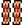
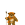
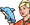
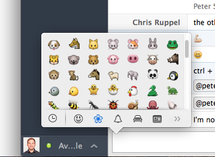

# 4K HipChat emoticons

> :information_desk_person: We've made the switch to Slack so this repo is effectively a time capsule of a bygone era.

We've expanded on the core set of emoticons included with HipChat and added our own.

If you're signed into the HipChat website, **[hipchat.com/emoticons](https://www.hipchat.com/emoticons/)** will show you **ALL of the available emoticons!**

## Emoticons

 (y)

 (n)

 (4K)

 (archer)

 (bacon)

 (bike)

 (dance)

 (dietcoke)

 (digdug)

 (dolphin)

 (drupal)

 (dude)

 (eliaface)

 (ewok)

 (git)

 (hamburger)

 (handhug)

 (home)

 (horse)

 (hr)

 (inbread)

 (jazzhands)

 (jim)

 (metal)

  (nyan)(cat)

 (octocat)

 (penguin)

 (pizza)

 (poolparty)

 (puke)

 (sandwich)

 (shipit)

 (stallman)

 (sushi)

 (tux)

 (taco)

 (timeforthat)

 (torvalds)

 (wonka)

 (wolverine)

## Web Chefs

You can also summon any of the Web Chefs using `(firstname)`, except for the Chrises:  `(rupl)` and  `(chrisd)`.

## Creating your own emoticons

We are using HipChat's built-in emoticon feature, which means an admin must upload the image in order for it to work. However, you can still create a pull request to get your icon into the repo, then let a HipChat admin know.

* Largest height/width dimension must be between 64px and 120px
  * Note: Your emoticon will be scaled down to 32x32
  * Ideal sizes are 64x64, 96x96, 120x120
  * At the very least, each side of your emoticon should be a multiple of 4
* Transparent PNG files give the best results
* Animated gifs are supported
* Images must be under 1MB
* [More info](http://help.hipchat.com/knowledgebase/articles/276750-how-to-create-custom-emoticons/)

### Find inspiration

* [emoji-cheat-sheet.com](http://www.emoji-cheat-sheet.com/) ([source](https://github.com/arvida/emoji-cheat-sheet.com/tree/master/public/graphics/emojis/))
* [ModCloth's emoticons](https://github.com/modcloth/hipchat-emoticons/)
* [Skype emoticons](http://emoticonhq.com/skypeemoticons.html)

## Need more emojis?

Mac client: From the chat window press `ctrl+cmd+space` to bring up the emoji window.

## Why can't I use emojis like in Github?

I guess HipChat isn't that hip yet. Make noise with others on the [feature request page](http://help.hipchat.com/forums/138883-suggestions-issues/suggestions/3407099-add-github-s-emoji-set).
